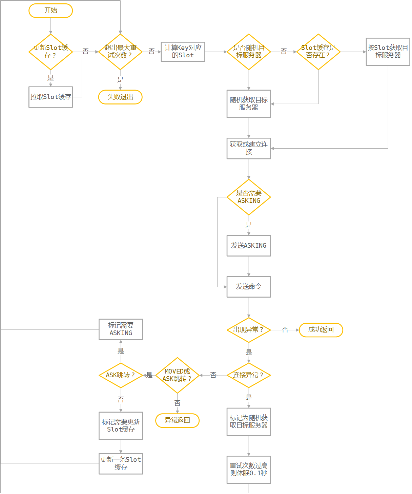
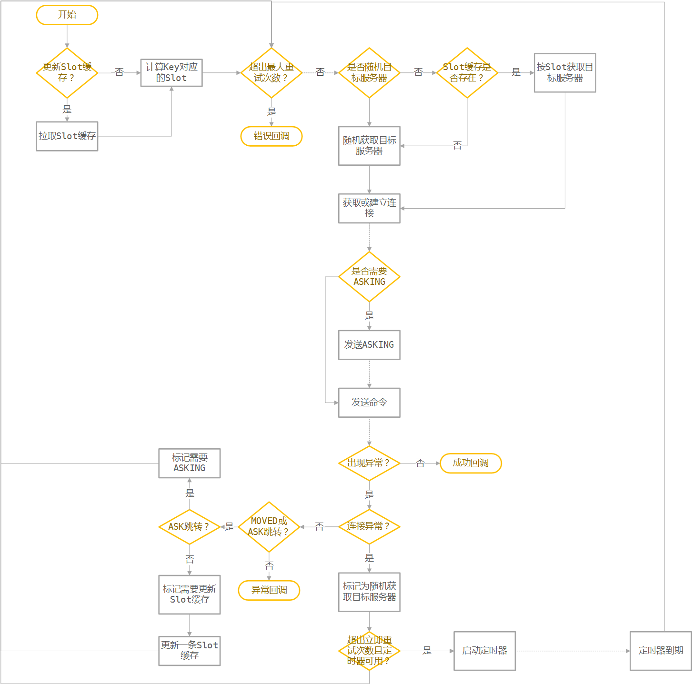
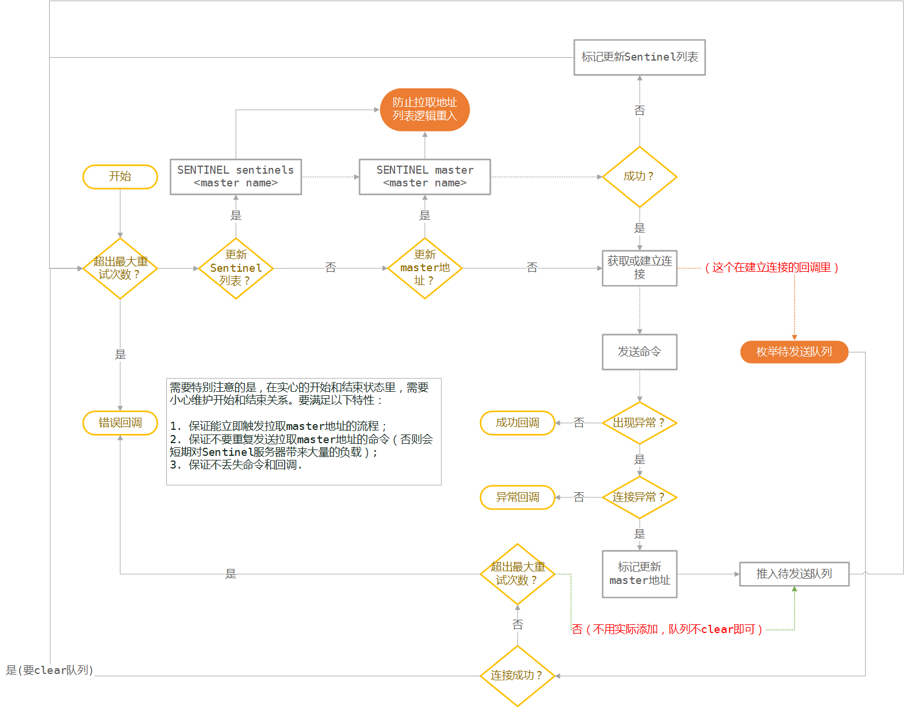

Redis全异步高可用 Driver 设计稿
==============================

[TOC]

前言
------

现在 Redis 的集群功能已经 Release。但是并没有一个官方直接提供的高可用 API 可以使用，有的只有解决方案：Sentinel 和 Cluster。所以有必要自己设计一套高可用的 Driver 层以供业务使用。

Cluster
------

Redis 3.X 已经 release，这个版本提供了一个重要的功能，那就是集群（Cluster）。但是虽然 Redis 的集群功能已经提供，目前还没有一个非常成熟的操作 Redis 集群的连接 driver。而在我们游戏项目中，会需要一个稳健的 driver 来屏蔽底层细节，并且必须要使用全异步接口。

在开始前，我在某个论坛里看到 [cpp-hiredis-cluster](https://github.com/shinberg/cpp-hiredis-cluster) 对 Redis 的 Cluster 支持得不错，就先大概看了一下它的实现，发现了几个问题。

1. 第一次连接集群节点采用的是同步操作，不过只有第一次是这样，问题也不大。
1. 执行 `redisAsyncConnect` 函数以后并没有关心是否连接成功，也就是说，即便连接失败了，连接仍然保存到了连接池中。
1. 没有关心断线的情况，也就是说，如果连接断开了，既不会重连，也不可能发送成功。
1. 没有支持 slaver，也没有关心断线问题，如果 master 挂了，就没有然后了。
1. `retry` 机制有问题。我看到的逻辑大概是这样：如果发现 `CLUSTERDOWN` 消息，则重试，并且是立即重试。并且重试的时候仍然用了原来的连接（还是没支持 slaver 导致的）。一般情况下，集群出现故障的时候必然会有一定的恢复时间，并且按照 Redis 的规则，会把 slaver 节点提升为 master，立即用原来的 master 连接重试毫无意义。
1. 每次检测到 `MOVE` 或者 `ASK` 消息都创建了一个新的 Redis context，其实可以重用已有的。
1. 它里面使用了 `std::map` 来保存 slot 到 Redis context 的映射关系，key 是一个 slot 区间。搜索算法是找到第一个最小区间满足要求的 slot。再加上上一条问题，导致 Redis 如果在做扩容，原先已经失效的索引仍然存在，并且之后对这个 key 一定每次都会收到 `MOVED` 消息，然后每次都重新创建 Redis context 和新连接，并覆盖原先的连接，而且覆盖前没有释放前一个 Redis context，造成严重的资源泄露。

总而言之，实现得很渣渣，所以还是需要自己维护一个连接 Redis Cluster 的工具。

Sentinel
------

有一些服务其实不需要 Cluster 那么复杂的操作。比如积分排行榜，直接主 + 备就够了。而要做到这方面数据安全，还是需要 Sentinel 来监控。

要解决的问题
------

1. 支持自动断线重连。
1. Redis Cluster 不支持多个 DB 分区（一定要用 DB0），并且最好对于不同类型业务可以部署在不同集群里，以便减少不同模块之间的影响，所以也需要提供多集群功能（类似 SQL 中的多个数据库）。
1. 要支持对 Cluster 的监控和统计。
1. 要支持多个通道（Channel）的设计（类似 Redis 的多个 DB 库），要实现不同通道之间完全隔离。

Redis-Cluster 适配设计
------

Redis-Cluster 环境条件
------

1. 因为 Slot 只有 16384（16K）个，即便把所有 Slot 按 Index 放在数组里缓存也不会消耗太大的内存，并且这样查找是 O(1) 的。
1. 尽量减少类似 `MSET` 的多 key 指令使用（包括涉及多个 key 的脚本），因为可能不同的 key 会分布在不同的 Slot 上。在使用 Cluster 时，涉及多个 key 的指令，这些 key 必须拥有相同的 hash 值或 hash tag，详见 [Redis Cluster tutorial](http://redis.io/topics/cluster-tutorial#migrating-to-redis-cluster)。
1. 要内部完成**指令跳转和重试**，需要自动处理 `MOVED`、`ASK` 和 `TRYAGAIN` 错误：
   - `MOVED` 命令出现在扩容和故障迁移时，这时候要永久更换 Slot 对应的连接。
   - `ASK` 表示临时跳转，仅仅这一次消息使用新的连接。比如正在扩容的过程中（某个 slot 由 A 转向 B），数据可能还没全部转移完，那么访问 A 节点的这个 slot 时可能找不到数据，这时候 `ASK` 跳转可以把目标指向当前有数据的节点（B）。
   - `ASK` 跳转还有一个特别的步骤：客户端先要发送一个 `ASKING` 命令，然后再重发这次的命令，不然处于导入状态的槽会被拒绝访问。
   - 在重新分片过程中的多个键值操作可能导致 `TRYAGAIN` 错误，这时候需要尝试重发命令。
1. 基本操作参考 [redis-rb-cluster](https://github.com/antirez/redis-rb-cluster)，这是 Redis 作者写的 Ruby 版本 Cluster driver。

redis-rb-cluster 分析
------

Redis 作者建议对 Cluster 的支持仿照 [redis-rb-cluster](https://github.com/antirez/redis-rb-cluster) 进行，那么我们来对这个库的实现流程做一个简单分析。

1. 首先，`redis-rb-cluster` 和我们上面想得一样，是缓存了 16384 个槽。
1. 它实现了按需连接。就是说当第一次连接某个 server 时，仅仅会拉取 Slot 和服务器的关系列表，并没有真正建立连接，而是等第一次需要这个连接的时候才建立连接。
1. 限制了最大重定向次数，防止重定向死循环。
1. 按需连接的时候，如果出现超时、连接被拒绝、连接失败的错误，0.1 秒后重试。
1. 如果按 slot 查找连接没找到，则会返回一个随机的连接，然后根据 `ASK` 或者 `MOVED` 跳转来处理。
1. `ASK` 和 `MOVED` 跳转都会启动拉取所有 Slot 信息的行为，来更新 Slot 缓存。
1. 拥有最大连接数限制，如果新建连接的时候超出最大连接数，随机关闭一个连接。

执行 Redis 指令流程
------

设计要点
------

`redis-rb-cluster` 写得确实比较漂亮，简单清晰。连我这种完全不懂 Ruby 的人都能看懂。但是它的实现是全同步的操作，我们这里要求全异步操作时就会更加麻烦一点。

- 首先是整个操作过程可以直接使用 hiredis，使用起来比较简单，全程单线程，避免不必要的加解锁和逻辑复杂度。
- 其次所有操作都要转为异步模式，因为不能预估操作的流程，所以还必须增加一层调用包装，用来包裹指令数据，这点和 [cpp-hiredis-cluster](https://github.com/shinberg/cpp-hiredis-cluster) 的 `Command` 一样。
- 然后，要增加集群 Server 的概念，以便用一套接口操纵多个集群。这样的话，所有的数据结构中不能出现单例。
- 直接利用 hiredis 的 adapter 来做事件绑定，方便工具迁移。
- 使用 `redisFormatSdsCommandArgv` 和 `redisAsyncFormattedCommand` 来保存命令和执行命令（和 [cpp-hiredis-cluster](https://github.com/shinberg/cpp-hiredis-cluster) 一致），执行的命令保存为 sds 后放到 `Command` 的数据包装里。
- 为保证简单，我们的 driver 也可以使用主循环模式（和 [redis-rb-cluster](https://github.com/antirez/redis-rb-cluster) 一样）。因为出现异常的情况会是少数，而正常情况下主循环只会执行一个循环。
- 同样，使用主循环就需要设定最大循环次数，并且失败次数过高时休眠一段时间，用以避免逻辑死循环。
- 使用按需建立连接，全局只保存**Slot-服务器地址缓存**和**服务器地址-连接池缓存**。
- hiredis 里大量使用了 `malloc`，所以还是必须上 jemalloc 或者 tcmalloc 才比较靠谱。
- 第一次连上以后应该像 [redis-rb-cluster](https://github.com/antirez/redis-rb-cluster) 一样发送一次拉取所有 Slot 信息的操作。
- 某些命令和 `redis-rb-cluster` 一样，随机选取发送目标。

最后有一个要特别注意的是**丢包和超时**。

1. 丢包问题：虽然说 TCP 连接能保证数据包的顺序，并且自带网络包重发，但是在**连接断开的时候仍然会出现丢包**的情况。
1. 超时问题：hiredis 的异步 API 里没有超时判定，但是因为 TCP 包底层的重传机制，超时只有一种可能，那就是连接断开。然后要么是上面提到的情况，没有发送成功，要么是回包丢失。

无论上述哪种情况，都会导致连接异常。根据对 hiredis 源代码的分析，（除了 `subscribe` 和 `unsubscribe` 命令外）这时候 hiredis 一定会回调所有没有完成的 callback，然后响应 disconnect 事件，并且这时候 `redisReply* reply = nullptr`。

补充说明：

- `subscribe` 和 `unsubscribe` 命令除外，订阅命令的回调是个字典。
- `subscribe` 命令的回调会在每次收到消息的时候都调用。

**上层应用逻辑需要自己有一个超时机制和对超时后又收到回包的容错机制**。

定时器
------

由于异步 API 不允许 sleep 操作，所以所有延迟操作都应该在定时器回调中执行。然而为了保证像 hiredis 一样支持多种 binding 机制，只能由使用方来创建和设置定时器回调，并**在回调中调用提供的 `proc` 方法**。

为了简化设计，我们定义以下规则：

1. 所有定时器的间隔一致（定时器队列可以直接链表实现）。
1. 每个 Channel 有自己的定时器，并且定时器接口调用至少一次以后才会开启带定时器的功能（例如：sleep）。
1. 假设系统中的 Channel 数量不会很多，这样定时器就不会很多，性能开销比较小。

连接和重连等待
------

异步操作的另一个问题是连接和重连的时候的等待问题，因为在连接完成期间，可能会收到新的命令请求。hiredis 的做法是每次来了一个请求以后就放到缓冲区里，并且在 Context 可写时立即写出。

我们这里可以直接利用它的这个机制。但是在重新拉取并建立 Slot 缓存的时候，没有 Redis 连接可以用于保存命令，所以可以在 Channel 里使用一个链表保存更新完 Slot 缓存后的执行命令集。

然后额外需要做的就是支持断线后的重连功能了。

Cluster 设计总结
------

简单地说，就是需要在 hiredis 上包一层，来完成对 Cluster 中内部操作。实现的过程中会导致多一次 `malloc` 和多一次 sds 复制操作。流程图如下：

Sentinel 适配设计
------

Sentinel 设计思路
------

Sentinel 比较简单，大体上和 Cluster 一致，有几个不一样的地方如下：

1. 第一次连接的是 Sentinel 节点而不是数据节点。
1. 连接的 Channel 要附带 `master name`，并且要通过 `SENTINEL sentinels <master name>` 拉取并连接 Sentinel。
1. 连接完毕后需要先通过 `SENTINEL master <master name>` 拉取 master 数据。
1. 发送失败的重试流程是重新走 `SENTINEL master <master name>` 拉取 master。
1. `SENTINEL master <master name>` 失败和 Sentinel 连接出现问题需要先执行上面的第 2 步，再重试。
1. 由于 Sentinel 拉取 master 地址之前，还不能建立到 master 的连接，所以 Channel 里要保存需要发送的命令 sds 队列，并等待连接成功后发送。如果 Sentinel 连接失败或者拉取不到服务器地址，要执行回调并出错。

更进一步
------

1. 更好的实现方式是可以订阅 Sentinel，从而更快地响应故障转移。
1. 读操作在配置允许的情况下可以走 slave，以减小 master 压力。
1. Sentinel 的连接可以共享（这里貌似会涉及到单例管理器）。

不过这些功能可选，以后可以有时间再加。

Sentinel 设计总结
------

流程图如下：

集群健康报告
------

对于 Cluster 而言，使用 `CLUSTER *` 命令就可以完成这些功能，并且总是随机取发送目标。

对于 Sentinel 而言，Sentinel 提供了简单的方式获取 master 的状态。要获取更详细的信息，可能得用比较麻烦的方法，一次访问多个 master 和 slaves（这里没仔细研究，以后再看）。

另外 Driver 层可以提供一些事件给上层用于统计重连、断线等情况。

写在最后
------

整体上最重要的思路就是用主循环来简化逻辑复杂度。而主循环增加的那部分 CPU 消耗几乎可以忽略，不过这种异步传参方式对应着大量的 `malloc` 操作，以后看需要可以优化成 C++ allocator 的机制，这样就能支持自定义内存池。

流程图中建立连接后的命令发送流程比较特别，因为 hiredis 的异步发送接口是向缓冲区中添加数据，并且等 fd 可写后才实际执行，所以可以不等 connect 完成就直接调用发送接口。

另外，Cluster 更新服务器连接池的方式比较讨巧，既能避免频繁更新地址池，又可以及时更新 Slot 缓存，需要注意一下。

以上思路我会先在 [owt5008137/hiredis-happ](https://github.com/owt5008137/hiredis-happ) 中进行实现和测试，然后用于生产环境。

> Written with [StackEdit](https://stackedit.io/).
